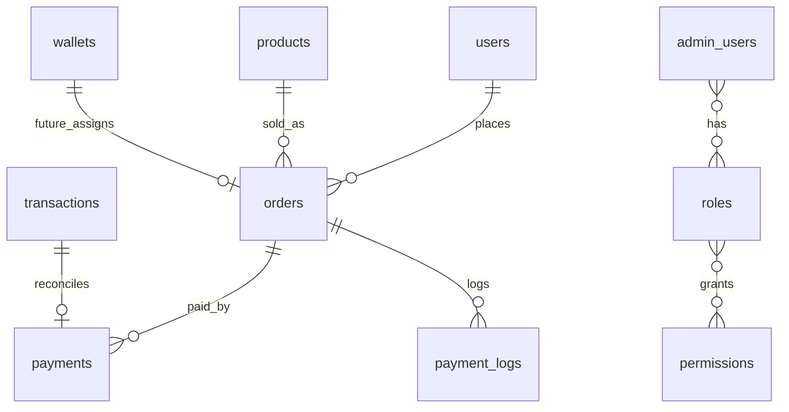

# USDT(TRC20) Payment API

Base URL: `/api/v1`

## Flow

1. `POST /auth/register` or `POST /auth/login`
2. `GET /products`
3. `POST /orders`
4. Show `payAddress`, `payAmount`, `qrCodeDataUrl`
5. Listener confirms TRC20 USDT transfer to `TWEaLoQqKWnxdvARfULsm9R94bKk3rnWis`
6. `GET /orders/{orderNo}/payment-status`

## Public Auth

### Register

`POST /auth/register`

```json
{ "email": "user@example.com", "password": "Password123!" }
```

### Login

`POST /auth/login`

```json
{ "email": "user@example.com", "password": "Password123!" }
```

Response:

```json
{ "accessToken": "jwt", "tokenType": "Bearer" }
```

## Products

`GET /products`

`GET /products/{id}`

Admin product CRUD:

`POST /products`, `PATCH /products/{id}`, `DELETE /products/{id}`

Required permission: `product:write`.

## Orders

All order endpoints require `Authorization: Bearer <token>`.

### Create Order

`POST /orders`

```json
{ "productId": 1, "quantity": 1 }
```

Response includes:

```json
{
  "orderNo": "ORD20260616000001",
  "payAddress": "TWEaLoQqKWnxdvARfULsm9R94bKk3rnWis",
  "payAmount": "100.01",
  "qrCodeDataUrl": "data:image/png;base64,...",
  "status": "PENDING_PAYMENT",
  "expiresAt": "2026-06-16T..."
}
```

### Query Order

`GET /orders/{id}`

### Payment Status

`GET /orders/{orderNo}/payment-status`

## Payments

`GET /payments/order/{orderId}`

## Signed Payment Webhook

Used for manual or third-party push mode. Tron listener is enabled by default.

`POST /webhooks/payment`

Headers:

- `x-timestamp`: Unix milliseconds
- `x-signature`: `hex(hmac_sha256(SIGNING_SECRET, timestamp + "." + json_body))`

Body:

```json
{
  "txid": "abc",
  "fromAddress": "T...",
  "toAddress": "TWEaLoQqKWnxdvARfULsm9R94bKk3rnWis",
  "amount": "100.010000",
  "blockNumber": 123
}
```

## Admin

`POST /admin/login`

`GET /admin/orders` permission `order:read`

`GET /admin/payments` permission `payment:read`

`GET /admin/payment-logs` permission `payment:read`

`GET /admin/products` permission `product:read`

`GET /admin/users` permission `user:write`

`PATCH /admin/users/{id}/freeze` permission `user:write`

`PATCH /admin/users/{id}/unfreeze` permission `user:write`

`GET /wallets` permission `wallet:read`

## ER Diagram



## Risk Control

- Orders expire after 30 minutes via scheduled job.
- Unique amount reservation uses Redis `SET NX` per address and amount.
- `transactions.txid` and `payments.txid` are unique.
- Amount match requires exact two-decimal payable amount.
- Abnormal transfers are written to `payment_logs`.
